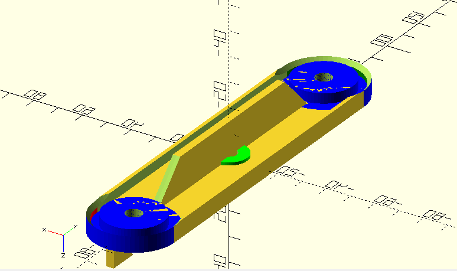
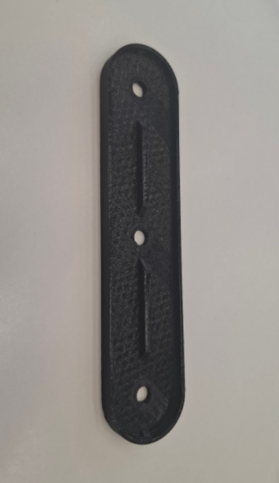
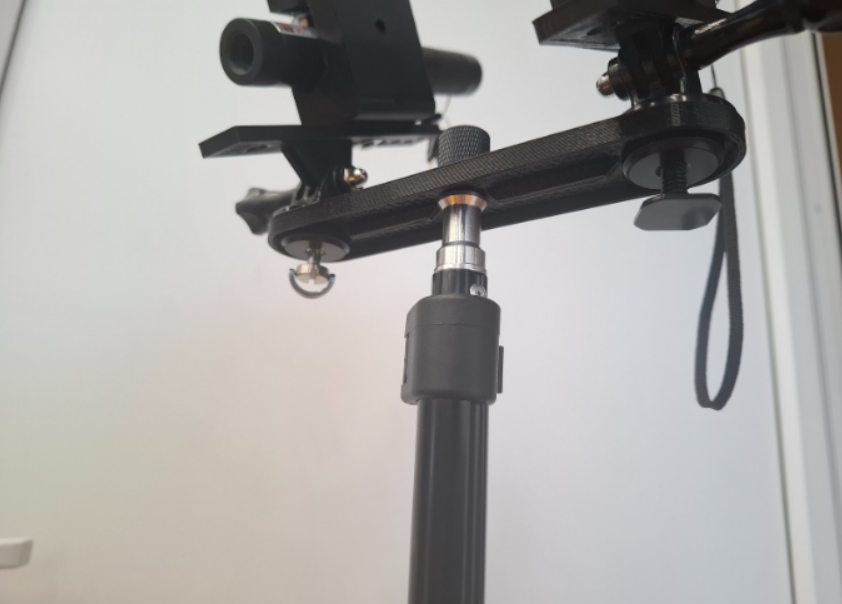

# Работа Корепанова Андрея и Третьякова Никиты
# Проект “Лазерная установка двойного наведения” на языке OpenScad

Модкль для 3D-печати, которая хакрепляеться на штативе с винтом 1/4". На нее устанавливаються две лазерный указки. С помощью винтов и гает так же с диаметром резьбы 1/4". 

Модели кронштейна для лазерных указок:
[Модель в формате OpenScad](https://github.com/ifizmat/laser-holder) в репозитории на гитхаб laser-holder.

# Фотографии напечатанной модели

# Фотографии установки

